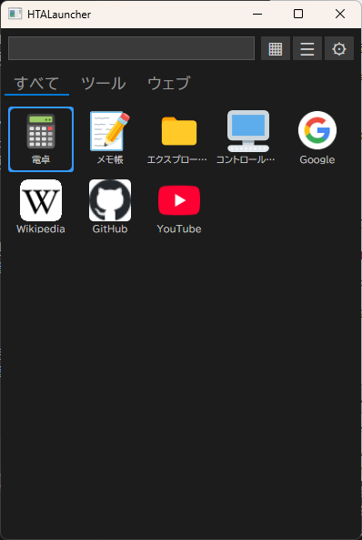
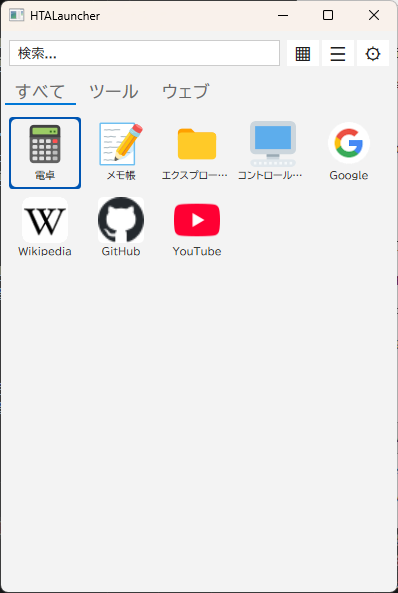
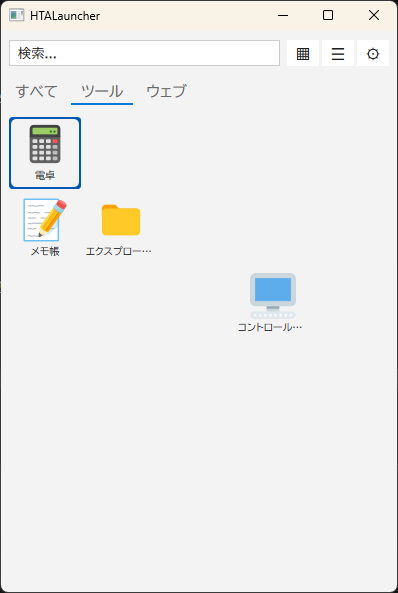
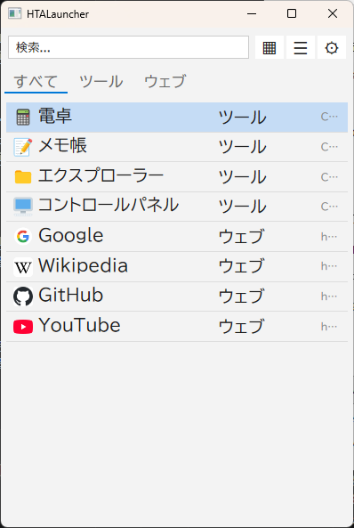
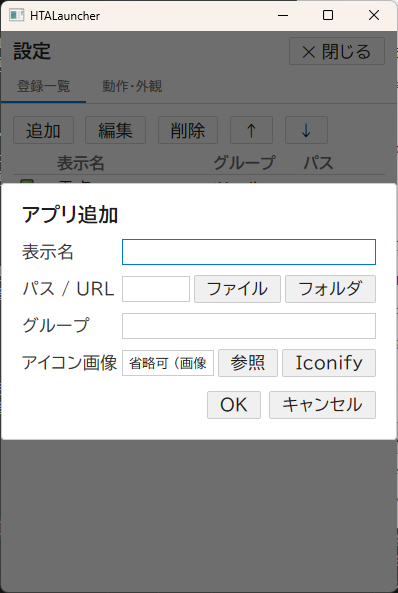
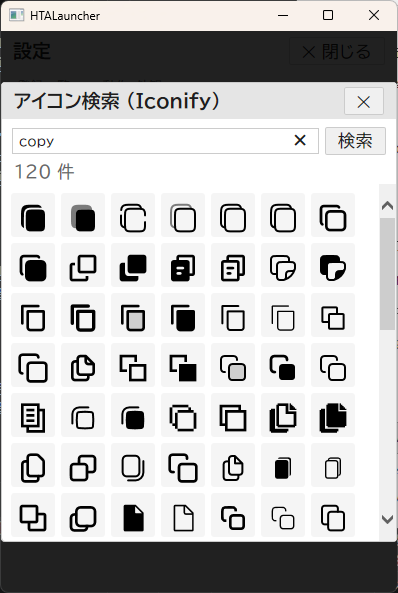
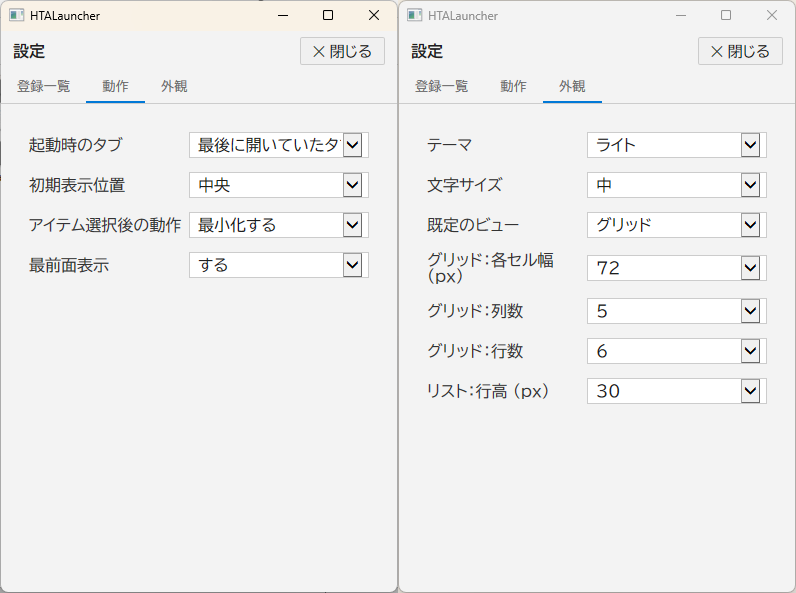

# HTALauncher

HTALauncherは、Windows用のHTA（HTML Application）ベースのアプリランチャーです。
アプリのショートカットをグリッドビューまたはリストビューで表示し、タブでグループ管理できます。

---

## 画面イメージ

### グリッドビュー（ダーク）


### グリッドビュー（ライト）


### 自由なグリッドレイアウト


### リストビュー


### アプリ追加画面


### アイコン選択（Iconify）


### 設定画面


---

## インストール

1. このリポジトリをクローンまたはダウンロード
2. `HTALauncher.hta` をダブルクリックして起動

**システム要件:** Windows（`mshta.exe` 標準搭載）

---

## 機能

### アイテム管理

- 設定画面の「追加」ボタン、または余白の右クリックメニューからアイテムを追加
- アイテムごとに **表示名・パス／URL・グループ・アイコン画像** を設定
- 設定画面で編集・削除・上下移動が可能
- **CLaunch.ini 取込**: CLaunchの設定ファイルからアイテムを一括インポート

### タブグループ

- アイテムの「グループ」フィールドに文字を設定するとタブが自動生成される
- 「すべて」タブは全アイテムを表示

### ビュー

| ビュー | 説明 |
|--------|------|
| グリッド | アイコン＋ラベルのタイル表示 |
| リスト | 名前・グループ・パスを表形式で表示 |

ヘッダーの `▦` / `☰` ボタンで切り替え。

---

## グリッドビューの配置

### 「すべて」タブ
全アイテムを左上から順に敷き詰め表示。グリッドでの**ドラッグ＆ドロップ**でアイテムの順序を変更できる。

### グループタブ（「すべて」以外）
アイテムごとに **列（col）・行（row）** の座標を持ち、自由な位置に配置される。

- アイテムをドラッグして別の位置にドロップすることで配置を変更
- 同じ座標に別のアイテムをドロップするとスワップ
- 位置未設定のアイテムは左上から自動配置
- 枠外に配置されたアイテムはスクロールバーで表示

---

## 検索

- ヘッダーの検索ボックスに文字を入力するとリアルタイムで絞り込み
- **全角・半角・大文字・小文字を区別しない**あいまい検索に対応
- グループタブを開いている状態で文字を入力すると**「すべて」タブに自動切り替え**して全アイテムから検索。検索をクリアすると元のタブに戻る

---

## キーボード操作

| キー | 動作 |
|------|------|
| `↑` `↓` `←` `→` | 選択アイテムを移動 |
| `Enter` | 選択中のアイテムを起動 |
| `Ctrl+Tab` / `Ctrl+Shift+Tab` | タブを切り替え |

**グリッド（「すべて」タブ）:** 行・列単位で2次元移動  
**グリッド（グループタブ）:** 全アイテムが収まる最小の矩形範囲内を移動。空セルにもカーソルが移動でき（枠のみ表示）、その位置でEnterを押しても何もしない  
**リスト:** 上下移動のみ  
タブ切り替え時は、そのタブ内で最も左上に近いアイテムが自動選択される。

---

## ドラッグ＆ドロップ

| 操作 | 結果 |
|------|------|
| ファイル／フォルダをランチャーにドロップ | アイテムを自動追加（名前はファイル名から取得） |
| URLをドロップ | Webショートカットを追加（ページタイトル・ファビコンを自動取得） |
| アイテムを別のアイテムにドロップ（「すべて」タブ） | 並べ替え |
| アイテムをグリッド上の位置にドロップ（グループタブ） | その座標に移動 |

グループタブで外部ファイルをドロップした場合、ドロップした座標にアイテムが配置される。

---

## 右クリックメニュー

| 対象 | メニュー |
|------|---------|
| アイテム上 | 編集 / 削除 |
| 余白 | 追加 |

---

## アイコン

- **カスタム画像**: `.ico` / `.png` / `.bmp` / `.jpg` ファイルを指定
- **Iconify**: [Iconify API](https://iconify.design/) でアイコンをキーワード検索して選択
- **ファビコン自動取得**: URLアイテムはGoogleファビコンサービスから自動取得
- アイコン未設定の場合はアイテム名の頭文字＋色でアイコンを自動生成

---

## 設定

設定画面（`⚙` ボタン）は3タブ構成。

### 動作タブ

| 項目 | 選択肢 |
|------|--------|
| 起動時のタブ | すべて / 最後に開いていたタブ |
| 初期表示位置 | 左上・右上・左下・右下・中央 |
| アイテム選択後の動作 | 最小化する / アプリを終了する / そのまま |
| 最前面表示 | する / しない |

### 外観タブ

| 項目 | 選択肢 |
|------|--------|
| テーマ | ダーク / ライト |
| 文字サイズ | 小 / 中 / 大 |
| 既定のビュー | グリッド / リスト |
| グリッド：各セル幅 | 48〜112 px |
| グリッド：列数 | 2〜15 |
| グリッド：行数 | 2〜12 |
| リスト：行高 | 20〜50 px |

---

## 設定ファイル

`config.json`（HTAと同じフォルダ）にアイテム一覧と設定が保存される。手動編集も可能。

### アイテムのデータ構造（例）

```json
{
  "apps": [
    {
      "name": "メモ帳",
      "path": "C:\\Windows\\System32\\notepad.exe",
      "iconPath": "",
      "group": "ツール",
      "tabPositions": { "col": 0, "row": 0 }
    }
  ],
  "settings": {
    "theme": "dark",
    "defaultView": "grid",
    "gridCellWidth": 72,
    "gridCols": 5,
    "gridRows": 6
  }
}
```

`tabPositions` はグループタブ内での座標（列・行）。「すべて」タブでは使用されない。

---

## ライセンス

MIT License

---

## 貢献

バグ報告・機能リクエストは GitHub Issues へ
