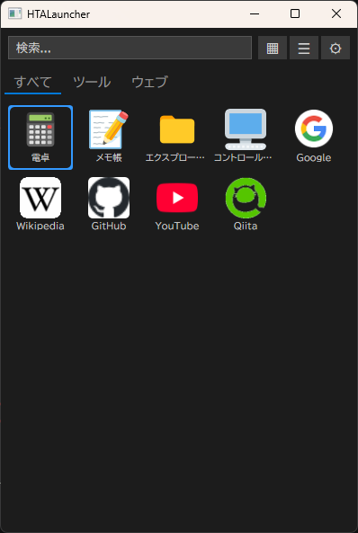
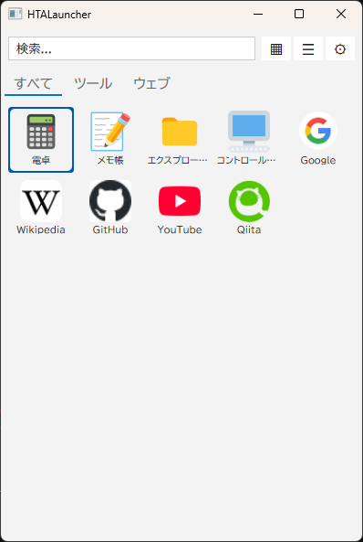
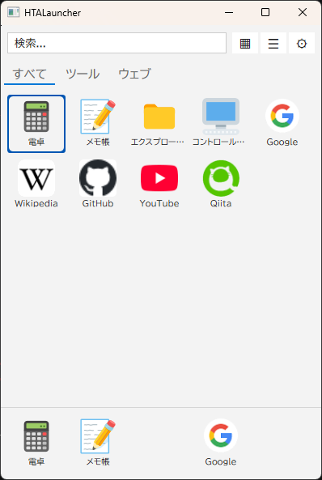
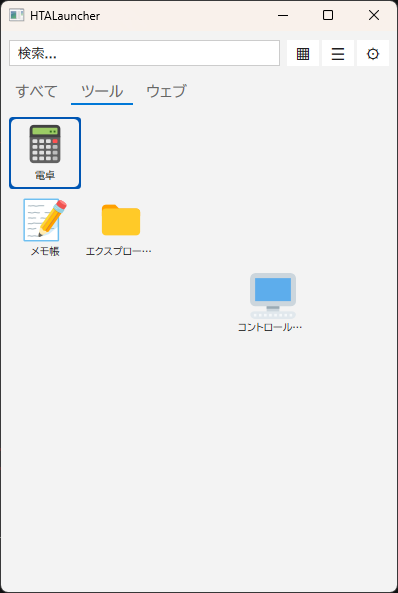
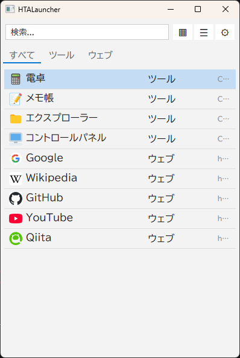
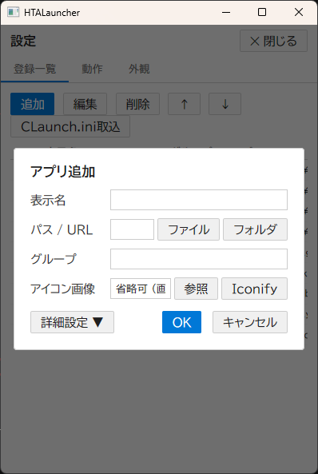
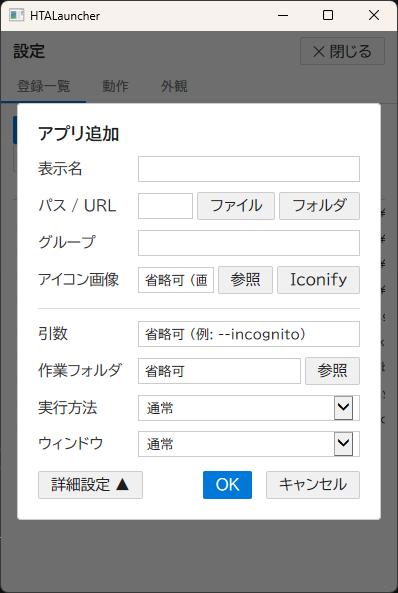
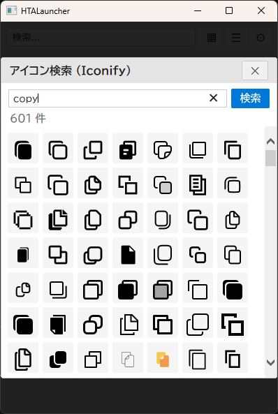
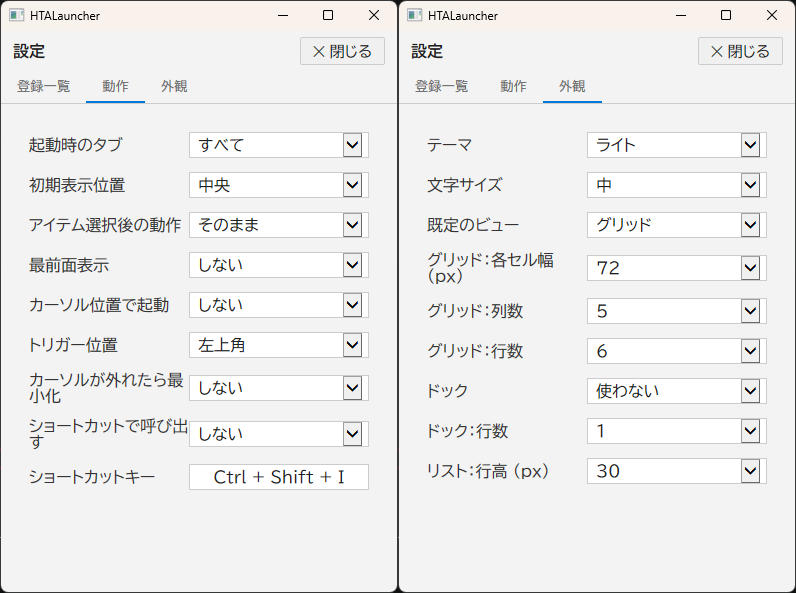

# HTALauncher

HTALauncherは、Windows用のHTA（HTML Application）ベースのアプリランチャーです。
アプリのショートカットをグリッドビューまたはリストビューで表示し、タブでグループ管理できます。

---

## 画面イメージ

### グリッドビュー（ダーク）


### グリッドビュー（ライト）


### ドック（画面下部に固定）


### 自由なグリッドレイアウト


### リストビュー


### アプリ追加画面


### 起動オプション（詳細設定）


### アイコン選択（Iconify）


### 設定画面


---

## インストール

1. `HTALauncher.hta` を好きな場所に置く
2. ダブルクリックして起動

**必要なファイルは `HTALauncher.hta` 1つだけ。** 設定ファイル `config.json` は初回起動時に同じフォルダへ自動生成される。

**システム要件:** Windows（`mshta.exe` / `powershell.exe` 標準搭載）

---

## 機能

### アイテム管理

- 設定画面の「追加」ボタン、または余白の右クリックメニューからアイテムを追加
- アイテムごとに **表示名・パス／URL・グループ・アイコン画像** を設定
- 「詳細設定」を開くと **引数・作業フォルダ・実行方法・ウィンドウ状態** も指定できる（[起動オプション](#起動オプション)）
- 設定画面で編集・削除・上下移動が可能
- **CLaunch.ini 取込**: CLaunchの設定ファイルからアイテムを一括インポート（引数・作業フォルダも取り込む）

### タブグループ

- アイテムの「グループ」フィールドに文字を設定するとタブが自動生成される
- 「すべて」タブは全アイテムを表示
- グループ名を `dock` にすると[ドック](#ドック)に置ける
- 開いていたタブは記憶され、次回の起動時も最小化からの復帰時もそのタブのまま。自分でタブを切り替えたときだけ変わる（検索中だけ一時的に「すべて」へ移り、クリアすると元のタブへ戻る）

### ビュー

| ビュー | 説明 |
|--------|------|
| グリッド | アイコン＋ラベルのタイル表示 |
| リスト | 名前・グループ・パスを表形式で表示 |

ヘッダーの `▦` / `☰` ボタンで切り替え。

---

## 起動オプション

アプリ追加／編集ダイアログの **「詳細設定」** ボタンで、起動時の細かい指定ができる。既にオプションが設定されているアイテムを編集するときは、自動的に開いた状態で表示される。

| 項目 | 内容 |
|------|------|
| 引数 | コマンドライン引数（例: `--incognito`） |
| 作業フォルダ | 起動時のカレントディレクトリ。「参照」ボタンで選択可 |
| 実行方法 | 通常 / 管理者として実行 |
| ウィンドウ | 通常 / 最大化 / 最小化 |

- 作業フォルダや管理者実行を指定した場合のみ `ShellExecute` 経由で起動する。指定が無ければ従来どおりの起動方法なので、既存のアイテムの挙動は変わらない
- URLアイテムでは引数・作業フォルダ・管理者実行は無視される（ウィンドウ状態のみ有効）
- 既定値のままの項目は `config.json` に書き込まれない

---

## ドック

スマートフォンのドックのように、**よく使うアプリを画面下部に固定**して常に表示できる。タブを切り替えても、検索で絞り込んでも、ドックの中身は変わらない。

- 設定の「外観」タブで **ドック** を「使う」にすると表示される
- **列数はグリッドの列数と同じ**。**行数は「ドック：行数」で指定**する（グリッドの行数から取り分ける形なので、行数より少ない値しか選べない）
- ドックのアイテムは、他のアイテムと同じく `group` が `dock` というだけ。**ドックをOFFにすると `dock` タブとして現れ**、ONに戻すとタブが消えてドックに並ぶ。配置（列・行）はどちらでも引き継がれる
- ドックのアイテムは「すべて」タブにも表示され、検索にもヒットする
- ドックの余白を右クリックして「追加」すると、グループ欄が `dock` の状態でダイアログが開く
- コンテンツ側のアイテムをドックへドラッグすると移動できる。ドックから外へドラッグすれば元に戻せる

---

## 検索

- ヘッダーの検索ボックスに文字を入力するとリアルタイムで絞り込み
- **全角・半角・大文字・小文字を区別しない**あいまい検索に対応
- グループタブを開いている状態で文字を入力すると**「すべて」タブに自動切り替え**して全アイテムから検索。検索をクリアすると元のタブに戻る
- `Ctrl+F` で検索ボックスにフォーカス

---

## グリッドビューの配置

### 「すべて」タブ
全アイテムを左上から順に敷き詰め表示。グリッドでの**ドラッグ＆ドロップ**でアイテムの順序を変更できる。

### グループタブ（「すべて」以外）
アイテムごとに **列（col）・行（row）** の座標を持ち、自由な位置に配置される。

- アイテムをドラッグして別の位置にドロップすることで配置を変更
- 同じ座標に別のアイテムをドロップするとスワップ
- 位置未設定のアイテムは左上から自動配置
- 枠外に配置されたアイテムはスクロールバーで表示

---

## キーボード操作

| キー | 動作 |
|------|------|
| `↑` `↓` `←` `→` | 選択アイテムを移動 |
| `Enter` | 選択中のアイテムを起動 |
| `Ctrl+Tab` / `Ctrl+Shift+Tab` | タブを切り替え |
| `Ctrl+F` | 検索ボックスへフォーカス |

**グリッド（「すべて」タブ）:** 行・列単位で2次元移動
**グリッド（グループタブ）:** 全アイテムが収まる最小の矩形範囲内を移動。空セルにもカーソルが移動でき（枠のみ表示）、その位置でEnterを押しても何もしない
**リスト:** 上下移動のみ
タブ切り替え時は、そのタブ内で最も左上に近いアイテムが自動選択される。

**ドックとの行き来:** 一番下の行からさらに `↓` を押すとドックへフォーカスが移り、ドックの一番上の行からさらに `↑` を押すとコンテンツ側へ戻る。戻ったときの選択位置は入る前のまま。ドックに入る位置は、直前に居た列に一番近いセルになる。

HTALauncher自体を他のアプリからキーひとつで呼び出したい場合は、[ショートカットキーで呼び出す](#ショートカットキーで呼び出す)を参照。

---

## ドラッグ＆ドロップ

| 操作 | 結果 |
|------|------|
| ファイル／フォルダをランチャーにドロップ | アイテムを自動追加（名前はファイル名から取得） |
| URLをドロップ | Webショートカットを追加（ページタイトル・ファビコンを自動取得） |
| アイテムを別のアイテムにドロップ（「すべて」タブ） | 並べ替え |
| アイテムをグリッド上の位置にドロップ（グループタブ） | その座標に移動 |
| アイテムをドックにドロップ | ドックへ移動（`group` が `dock` になる） |
| ドックのアイテムをコンテンツ側にドロップ | 開いているタブのグループへ移動 |

グループタブやドックで外部ファイルをドロップした場合、ドロップした座標にアイテムが配置される。

---

## 右クリックメニュー

| 対象 | メニュー |
|------|---------|
| アイテム上 | 編集 / 削除 |
| 余白 | 追加（グループは開いているタブ） |
| ドックの余白 | 追加（グループは `dock`） |

---

## アイコン

- **カスタム画像**: `.ico` / `.png` / `.bmp` / `.jpg` ファイルを指定
- **Iconify**: [Iconify API](https://iconify.design/) でアイコンをキーワード検索して選択
- **ファビコン自動取得**: URLアイテムはGoogleファビコンサービスから自動取得
- 取得した画像は `config.json` に data URL として焼き込まれるため、次回以降は通信しない
- アイコン未設定の場合はアイテム名の頭文字＋色でアイコンを自動生成

---

## 設定

設定画面（`⚙` ボタン）は3タブ構成。

### 動作タブ

| 項目 | 選択肢 |
|------|--------|
| 初期表示位置 | 左上・右上・左下・右下・中央 |
| アイテム選択後の動作 | 最小化する / アプリを終了する / そのまま |
| 最前面表示 | する / しない |
| カーソル位置で起動 | する / しない |
| トリガー位置 | 左上角・右上角・左下角・右下角・上端・下端・左端・右端 |
| カーソルが外れたら最小化 | する / しない |
| ショートカットで呼び出す | する / しない |
| ショートカットキー | 任意のキー（既定 `Ctrl+Alt+Space`） |

「最前面表示」は再起動なしでその場で切り替わる。
「初期表示位置」で端に寄せた場合は、画面の縁にぴったり接する位置に表示される（Windowsのウィンドウが左右と下に持つ「見えない余白」の分を補正している）。

### カーソル位置トリガー

「カーソル位置で起動」を「する」にすると、画面の指定した角（4px四方）または辺（画面いっぱいの4px帯）にカーソルを寄せることで、HTALauncherを最小化から復帰、または未起動なら新規起動できる。

- 常駐PowerShellが1つだけ背後で立ち上がり、`GetCursorPos` でカーソル位置を50ms間隔で監視する。ウィンドウを使った検知ではないため、**他のウィンドウに隠れて反応しなくなることがない**
- 常駐スクリプトは `HTALauncher.hta` の中に埋め込まれており、外部ファイルは不要
- この設定をONにした状態でHTALauncherを起動するたびに常駐プロセスが（未起動なら）自動的に立ち上がる。多重起動はしない
- OFFにすると、常駐プロセスは数秒以内に自動終了する
- Windowsログイン時の自動起動はしない（HTALauncherを一度手動起動するまではカーソルトリガーは働かない）
- トリガー領域はタスクバーを除いた作業領域が基準。「下端」ならタスクバーのすぐ上に反応する

### カーソルが外れたら最小化

「カーソルが外れたら最小化」を「する」にすると、マウスカーソルがHTALauncherのウィンドウから離れたときに自動で最小化される。「カーソル位置で起動」と組み合わせると、画面端に寄せると出てきて、離れると引っ込む使い方ができる。

- **一度カーソルがウィンドウ内に入ってから外に出たとき**だけ最小化する。起動直後や復帰直後にカーソルがウィンドウの外にあっても、いきなり最小化されることはない
- 判定はタイトルバーや枠を含めたウィンドウ全体が対象。タイトルバーを掴んでウィンドウを移動している最中や、閉じるボタンに手を伸ばしただけでは最小化されない
- 端をかすめただけで消えないよう、ウィンドウの外に **0.4秒** 留まってから最小化する
- フォルダ参照やファイル選択などのダイアログを開いている間は最小化しない
- **アプリ追加・編集ダイアログ、設定画面、確認メッセージを開いている間も最小化しない**。参照ボタンやアイコン検索で枠の外を操作することがあるため。これらはHTALauncherの中に描かれていて別ウィンドウとして判別できないので、開いている間だけ `%TEMP%\HTALauncherModal.flag` を置いて常駐プロセスに知らせている（閉じると消える）
- 検知はカーソル位置トリガーと同じ常駐PowerShellが担当する（「カーソル位置で起動」「カーソルが外れたら最小化」「ショートカットで呼び出す」のどれか1つでもONなら常駐し、すべてOFFで自動終了する）

> **注意:** 「カーソルが外れたら最小化」だけをONにすると、最小化したあとはタスクバーからしか戻せない。「カーソル位置で起動」または「ショートカットで呼び出す」も併せてONにしておくのがおすすめ。

> **注意:** 「初期表示位置」と「トリガー位置」が離れていると、カーソルで呼び出した直後にカーソルがウィンドウの外にあるため、すぐに最小化されてしまう。2つは揃えておくとよい。

### ショートカットキーで呼び出す

「ショートカットで呼び出す」を「する」にすると、どのアプリを使っている最中でも、設定したキーひとつでHTALauncherを呼び出せる。マウスを動かさずにキーボードだけで済むので、カーソル位置トリガーより速い。

**キーの設定:** 設定画面の「ショートカットキー」欄をクリックしてから、割り当てたいキーを実際に押す。押した組み合わせがそのまま登録される（`Esc` で取り消し）。

- **トグル動作**：HTALauncherが前面にあるときにもう一度押すと最小化する。最小化中・背面のときは復帰して前面に出る。未起動なら新規起動する
- 修飾キーは **Ctrl / Alt / Shift**。**Ctrl か Alt のどちらかを必ず含める**必要がある（修飾なしやShift単独を登録すると、そのキーの通常入力をシステム全体から奪ってしまうため）
- **Windowsキーを含む組み合わせは非対応**。WindowsキーはOSが先に処理してしまい、キー入力欄で押下を捕まえられないため
- 他のアプリが同じ組み合わせを先に使っている場合は登録できない。そのときは設定画面に「他のアプリが使用中のため登録できませんでした」と赤字で表示されるので、別のキーを試す
- 登録できているときは「有効です。」と表示される。反応しないときはまずここを確認する
- 検知はカーソル位置トリガーと同じ常駐PowerShellが担当する（`RegisterHotKey` で登録し、50ms間隔のループで `PeekMessage` を回している）。3つの設定のうちどれか1つでもONなら常駐し、すべてOFFで自動終了する
- カーソルトリガーと同じく、Windowsログイン時の自動起動はしない（HTALauncherを一度手動起動するまではショートカットも働かない）

### 外観タブ

| 項目 | 選択肢 |
|------|--------|
| テーマ | ダーク / ライト |
| 文字サイズ | 小 / 中 / 大 |
| 既定のビュー | グリッド / リスト |
| グリッド：各セル幅 | 48〜112 px |
| グリッド：列数 | 2〜15 |
| グリッド：行数 | 2〜12 |
| ドック | 使う / 使わない |
| ドック：行数 | 1〜（グリッドの行数−1） |
| リスト：行高 | 20〜50 px |

ウィンドウの大きさはセル幅・列数・行数から自動計算される（最小 280×200 px）。ドックはグリッドの行数から取り分ける形なので、ドックを使ってもウィンドウの大きさは変わらない。

---

## 設定ファイル

`config.json`（HTAと同じフォルダ）にアイテム一覧と設定が保存される。手動編集も可能。カーソルトリガーの常駐プロセスもこのファイルを1秒ごとに読み直すため、手動編集した設定もすぐ反映される。

> HTALauncherの起動中に `config.json` を直接書き換えても、起動中のインスタンスがメモリ上の設定を保持しているため、次の保存時に上書きされる。設定変更は設定画面から行うこと。

### アイテムのデータ構造（例）

```json
{
  "apps": [
    {
      "name": "メモ帳",
      "path": "C:\\Windows\\System32\\notepad.exe",
      "iconPath": "",
      "group": "ツール",
      "tabPositions": { "col": 0, "row": 0 }
    },
    {
      "name": "Chrome（シークレット）",
      "path": "C:\\Program Files\\Google\\Chrome\\Application\\chrome.exe",
      "iconPath": "",
      "group": "dock",
      "tabPositions": { "col": 0, "row": 0 },
      "args": "--incognito",
      "workDir": "C:\\Windows",
      "runAs": "admin",
      "winState": "max"
    }
  ],
  "settings": {
    "theme": "dark",
    "defaultView": "grid",
    "gridCellWidth": 72,
    "gridCols": 5,
    "gridRows": 6,
    "dockEnabled": false,
    "dockRows": 1,
    "cursorTriggerEnabled": false,
    "cursorTriggerPosition": "bottomRight",
    "hotkeyEnabled": false,
    "hotkey": { "ctrl": true, "alt": true, "shift": false, "vk": 32, "label": "Ctrl + Alt + Space" }
  }
}
```

| キー | 内容 |
|------|------|
| `tabPositions` | グループタブ・ドック内での座標（列・行）。「すべて」タブでは使用されない |
| `args` | コマンドライン引数。未指定なら省略される |
| `workDir` | 作業フォルダ。未指定なら省略される |
| `runAs` | `"admin"` のときだけ書かれる（管理者として実行） |
| `winState` | `"max"` / `"min"` のときだけ書かれる（未指定は通常） |
| `group` | `"dock"` のアイテムはドックに並ぶ（ドックOFFのときは `dock` タブ） |

`hotkey.vk` はWindowsの仮想キーコード（`Space` = 32、`A`〜`Z` = 65〜90、`F1`〜`F12` = 112〜123）。`label` は表示専用で、読み込み時に他の値から作り直される。

---

## ライセンス

MIT License

---

## 貢献

バグ報告・機能リクエストは GitHub Issues へ
